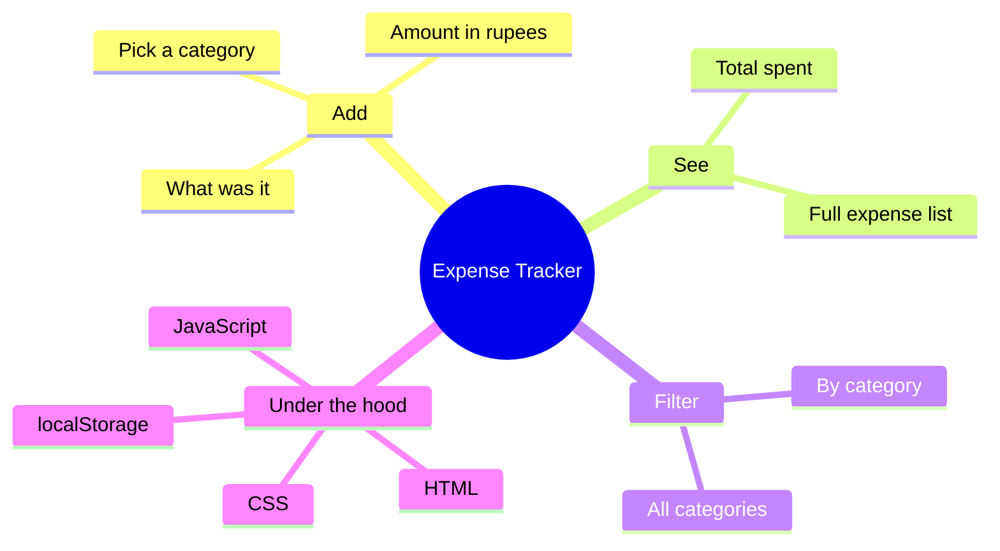

<h1 align="center">💰 Expense Tracker</h1>

<p align="center">
  <b>Add what you spend and see where your money goes.</b><br>
  A simple, no-fuss way to keep an eye on daily spending.
</p>

<p align="center">
  <a href="https://mouparnachowdhury.github.io/Expense-Tracker/"></a>
</p>

<p align="center">
  
  
  
  
  
</p>

---

## 💭 About

Small daily spending is easy to lose track of, and it adds up faster than you think. Expense Tracker is a tiny web app to jot down what you spend, tag it with a category, and watch a running total so the picture stays clear.

**Try it live:** https://mouparnachowdhury.github.io/Expense-Tracker/

<!--
  📸 SCREENSHOTS: add a screenshot here to make the repo pop.
  Put an image in a /screenshots folder and link it like:
  
-->

---

## ✨ What it does

- Add an expense with a name, an amount in ₹, and a category
- See a running **Total spent** update as you go
- Browse all your expenses in one clean list
- Filter the list by category to see where the money goes
- A friendly empty state when there is nothing logged yet

---

## 🗺️ At a glance



---

## 🧱 Built with

- HTML for the structure
- CSS for a clean, card-based look
- JavaScript for adding, totalling, and filtering
- Browser `localStorage`, so your expenses stay after you close the tab

No frameworks. This was about learning the fundamentals of building a real, working app from scratch.

---

## 🌳 Project structure

```text
expense-tracker/
├── index.html      # the app
├── style.css       # styles
└── script.js       # add, total, filter, and storage logic
```

> Adjust the file names above to match your actual files.

---

## ▶️ How to run it

You can just open the live link above, or run it yourself:

1. Download or clone this repository.
2. Open `index.html` in any web browser.
3. Start adding expenses.

---

## 🌱 Ideas for later

- A small chart of spending by category
- Monthly totals and a simple budget goal
- Edit an expense, not just add and remove
- Export your expenses to a file

---

<p align="center"><i>Built by Mouparna while learning to code 🌱</i></p>
